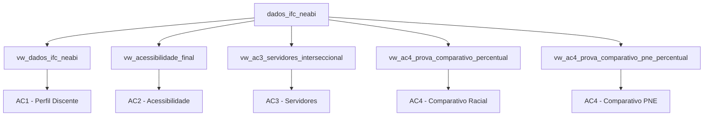

# 📊 Engenharia de Dados e Business Intelligence Aplicados à Interseccionalidade Étnico-Racial e PNE
Uma Extensão do Portal Farol IFC


> **Objetivo Institucional:** Desenvolvimento de uma solução de Business Intelligence e estruturação de uma camada de persistência e governança de dados para o NEABI (Núcleo de Estudos Afro-Brasileiros e Indígenas) do IFC - Campus Concórdia. O projeto analisa de forma analítica e interseccional a comunidade acadêmica do Instituto Federal Catarinense (IFC), mitigando falhas de contaminação de contexto e evidenciando com precisão o cenário de autodeclaração étnico-racial e acessibilidade.

---

## 📸 Visualização do Painel (Data Product)

### Página 1: Capa e Painel Executivo Geral


### Página 2: Perfil Étnico-Racial Discente (AC1) vs. Acessibilidade (AC2)
<p align="center">
  
  
</p>

### Página 3: Perfil dos Servidores (AC3) vs. Análise Comparativa Proporcional (AC4)
<p align="center">
  
  
  
</p>

---

## 📖 Glossário de Termos Institucionais

Para facilitar a interpretação do contexto institucional e das regras de negócio aplicadas ao pipeline, utiliza-se o seguinte mapeamento de acrônimos:

| Acrônimo / Termo | Significado Institucional | Contexto no Projeto |
| :--- | :--- | :--- |
| **IFC** | Instituto Federal Catarinense | Autarquia federal de ensino foco da análise de dados. |
| **NEABI** | Núcleo de Estudos Afro-Brasileiros e Indígenas | Núcleo proponente responsável por formular políticas de equidade. |
| **Discente** | Aluno Matriculado | Público-alvo das análises de diversidade e acessibilidade escolar. |
| **Servidor** | Corpo Funcional (Docentes e Técnicos) | Analisados quanto à ocupação de cargos e preenchimento de perfil racial. |
| **PNE** | Pessoa com Necessidade Específica | Alunos ou servidores que necessitam de atendimento especializado ou acessibilidade. |
| **TAE** | Técnico-Administrativo em Educação | Categoria funcional de servidores que atuam no suporte e gestão institucional. |

---

## 📈 Descobertas Analíticas Estratégicas (Data Insights)

A engenharia de dados aplicada na unificação das fontes permitiu extrair métricas cruciais sobre a realidade da instituição:

* **A Lacuna Crítica no Quadro Funcional:** Foi identificada uma severa lacuna de autodeclaração racial entre os servidores do IFC, totalizando **89,73% de registros sem informação** (`Não Declarado`), o que representa 1.756 servidores funcionais fora do mapeamento de diversidade.
* **Contraste de Autodeclaração (Alunos vs. Servidores):** Enquanto o corpo discente apresenta um excelente índice de preenchimento, com apenas **3,86% de lacuna racial**, o corpo de servidores perpetua uma ausência crônica de dados, inviabilizando análises de representatividade robustas para o comitê do NEABI.
* **Mapeamento de Neurodivergências Discentes:** Com a separação rigorosa de contextos promovida na AC2, identificou-se que o Transtorno do Espectro Autista (**TEA**) lidera as notificações de acessibilidade estudantil com **202 registros**, seguido de perto por **173 casos de TDAH**, direcionando de forma assertiva onde a reitoria deve aplicar os recursos de inclusão.

---

## ⚠️ Nota Metodológica

Os percentuais apresentados neste projeto refletem exclusivamente a situação dos registros disponíveis nos sistemas institucionais do Instituto Federal Catarinense (IFC) no momento da extração e processamento dos dados.

As análises realizadas descrevem padrões de preenchimento cadastral, autodeclaração étnico-racial e informações de acessibilidade registradas administrativamente, não devendo ser interpretadas como representação demográfica exata da comunidade acadêmica ou do quadro funcional da instituição.

Dessa forma, indicadores de representatividade podem estar sujeitos a limitações decorrentes da ausência, inconsistência ou desatualização de informações nos sistemas de origem, especialmente nos casos identificados de lacuna informacional.

---

## 🔗 Artefatos do Projeto

* 📋 **Gestão Ágil (Kanban):** [Acessar o Quadro do Projeto](https://github.com/users/AubioFerreira/projects/2)
* 📐 **Modelagem de Dados:** [Visualizar o Diagrama (MER)](https://github.com/AubioFerreira/analise-interseccional-ifc/blob/main/MER.drawio.png)
* 💾 **Scripts SQL:** [Acessar códigos de criação das Views e ETL](https://github.com/AubioFerreira/analise-interseccional-ifc/blob/main/script_banco_dados.sql)
* 📊 **Dashboard BI:** [Baixar o arquivo Power BI (.pbix)](https://github.com/AubioFerreira/analise-interseccional-ifc/blob/main/Dashboard_NEABI_IFC_v1.pbix)
* 📄 **Documentação:** [Ler o Relatório Final em PDF](./caminho-do-relatorio.pdf)

---

## 1. Arquitetura de Dados e Pipeline ETL

O ecossistema de dados foi estruturado seguindo as melhores práticas corporativas para garantir governança e escalabilidade:
* **Ingestão (Extract):** Processamento de dados brutos institucionais (17.953 registros) via arquivos CSV higienizados em conformidade com as diretrizes da LGPD.
* **Transformação (Transform):** Higienização avançada e tratamento de concorrência estrutural no PostgreSQL 17. Uso de `COALESCE` para tratamento de nulos, operadores de busca textual flexíveis (`ILIKE`) para *text mining* e tratamento de comorbidades, e **Window Functions (`OVER PARTITION BY`)** para realizar cálculos percentuais dinâmicos diretamente na fonte.
* **Carga (Load):** Conexão nativa e otimizada via Power BI, consumindo dados pré-calculados pelo banco de dados. Essa arquitetura zera o *overhead* de processamento no *frontend*, substituindo medidas DAX complexas por leitura de colunas prontas.

---

## 2. A Jornada Iterativa (Entregas por Etapa)

### 📍 AC1: Camada de Persistência e Isolamento Discente
* Estruturação da tabela principal `dados_ifc_neabi`.
* Criação da View `vw_dados_ifc_neabi` para isolamento estrito do corpo discente, corrigindo distorções históricas e garantindo cruzamentos interseccionais puros (Raça vs. PcD).

### 📍 AC2: Inteligência de Acessibilidade e Neurodivergência
* Desenvolvimento da View `vw_acessibilidade_final` focada exclusivamente em estudantes.
* Implementação de mapeamento textual para geração de flags binárias indexadas para estruturação visual de condições médicas especializadas (TEA, TDAH, Altas Habilidades, Deficiências Físicas e Sensoriais).

### 📍 AC3: Interseccionalidade Funcional e Homologação de Dados
* Criação da View especializada `vw_ac3_servidores_interseccional` focada estritamente no corpo funcional.
* Implementação de lógica defensiva contra nulos (`OR cor_raca IS NULL`) para blindagem de cargas futuras e consolidação do agrupamento étnico-racial unificado (`grupo_etnico`).

### 📍 AC4 (Prova Final): Visões Comparativas Proporcionais e Performance
* Criação das Views agregadas `vw_ac4_prova_comparativo_percentual` e `vw_ac4_prova_comparativo_pne_percentual`.
* Utilização de funções de janela analíticas do SQL para calcular a distribuição percentual interna de cada campus por categoria, entregando um painel executivo responsivo de alta performance.

---

## 🛠️ Pré-requisitos e Como Executar

Para reproduzir localmente este projeto de forma íntegra, siga as etapas abaixo:

1. **Banco de Dados:** Ter o PostgreSQL 17 (ou superior) instalado e rodando localmente na porta padrão (`5432`).
2. **Visualização:** Possuir o Microsoft Power BI Desktop instalado na máquina.
3. **Instalação:**
   * Crie um banco de dados vazio chamado `dados_ifc_neabi`.
   * Execute o script consolidado abaixo para gerar as tabelas, importar seus dados brutos de CSV e criar todas as camadas analíticas automatizadas.
   * Abra o arquivo `.pbix` no Power BI e atualize a credencial de banco de dados apontando para o seu `localhost`.

---

## 3. Script Master Consolidado (Single Source of Truth)

```sql
-- ============================================================================
-- SCRIPT MASTER: INFRAESTRUTURA DE DADOS - OBSERVATÓRIO NZILA
-- OBJETIVO: Criação, saneamento e consolidação das camadas analíticas (AC1 a AC4)
-- BANCO DE DADOS: PostgreSQL 17
-- ============================================================================

-- ----------------------------------------------------------------------------
-- TABELA PRINCIPAL: Ingestão Bruta
-- ----------------------------------------------------------------------------
CREATE TABLE IF NOT EXISTS public.dados_ifc_neabi (
    id SERIAL PRIMARY KEY,
    campus VARCHAR(100),
    categoria VARCHAR(50), 
    cor_raca VARCHAR(50),
    possui_need_especial VARCHAR(50),
    necessidades_especiais TEXT,
    dt_carga TIMESTAMP DEFAULT CURRENT_TIMESTAMP
);

-- ============================================================================
-- ETAPA AC1: Visão Filtrada do Corpo Discente
-- ============================================================================
DROP VIEW IF EXISTS public.vw_dados_ifc_neabi CASCADE;

CREATE VIEW public.vw_dados_ifc_neabi AS
SELECT *
FROM public.dados_ifc_neabi
WHERE categoria = 'Discente'; 

-- ============================================================================
-- ETAPA AC2: Inteligência de Acessibilidade e Neurodivergência (Estudantes)
-- ============================================================================
DROP VIEW IF EXISTS public.vw_acessibilidade_final CASCADE;

CREATE VIEW public.vw_acessibilidade_final AS
SELECT 
    *,
    -- Criação de Flags Binárias para contabilização de comorbidades
    CASE WHEN necessidades_especiais ILIKE '%TEA%' OR necessidades_especiais ILIKE '%AUTIS%' THEN 1 ELSE 0 END AS flag_tea,
    CASE WHEN necessidades_especiais ILIKE '%TDAH%' THEN 1 ELSE 0 END AS flag_tdah,
    CASE WHEN necessidades_especiais ILIKE '%VISUAL%' THEN 1 ELSE 0 END AS flag_visual,
    CASE WHEN necessidades_especiais ILIKE '%AUDITIVA%' OR necessidades_especiais ILIKE '%SURD%' THEN 1 ELSE 0 END AS flag_auditiva,
    CASE WHEN necessidades_especiais ILIKE '%FÍSICA%' THEN 1 ELSE 0 END AS flag_fisica,
    CASE WHEN necessidades_especiais ILIKE '%INTELECTUAL%' THEN 1 ELSE 0 END AS flag_intelectual,
    CASE WHEN necessidades_especiais ILIKE '%ALTAS HABILIDADES%' OR necessidades_especiais ILIKE '%SUPERDOT%' THEN 1 ELSE 0 END AS flag_superdotacao,
    
    -- Classificação da Necessidade Principal para engenharia visual
    CASE 
        WHEN necessidades_especiais ILIKE '%TEA%' OR necessidades_especiais ILIKE '%AUTIS%' THEN 'TEA (Autismo)'
        WHEN necessidades_especiais ILIKE '%TDAH%' THEN 'TDAH'
        WHEN necessidades_especiais ILIKE '%ALTAS HABILIDADES%' OR necessidades_especiais ILIKE '%SUPERDOT%' THEN 'Altas Habilidades'
        WHEN necessidades_especiais ILIKE '%INTELECTUAL%' THEN 'Deficiência Intelectual'
        WHEN necessidades_especiais ILIKE '%VISUAL%' THEN 'Deficiência Visual'
        WHEN necessidades_especiais ILIKE '%AUDITIVA%' OR necessidades_especiais ILIKE '%SURD%' THEN 'Deficiência Auditiva'
        WHEN necessidades_especiais ILIKE '%FÍSICA%' THEN 'Deficiência Física'
        WHEN necessidades_especiais IS NULL OR necessidades_especiais = '[null]' THEN 'Não Possui'
        ELSE 'Outras Necessidades'
    END AS necessidade_principal
FROM public.dados_ifc_neabi
WHERE categoria ILIKE '%Disc%' 
   OR categoria ILIKE '%Alun%' 
   OR categoria ILIKE '%Estud%';

-- ============================================================================
-- ETAPA AC3: SERVIDORES - PERFIL RACIAL E INTERSECCIONALIDADE
-- ============================================================================
DROP VIEW IF EXISTS public.vw_ac3_servidores_interseccional CASCADE;

CREATE VIEW public.vw_ac3_servidores_interseccional AS
SELECT
    campus,
    categoria,

    -- Tratamento preventivo de strings nulas
    COALESCE(cor_raca, 'Não Declarado') AS cor_raca,
    COALESCE(possui_necessidade_especial, 'Não Informado') AS possui_necessidade_especial,

    -- Agrupamento Étnico-Racial com blindagem contra herança de NULLs
    CASE
        WHEN cor_raca IN ('Preta', 'Parda') THEN 'Negros (Pretos/Pardos)'
        WHEN cor_raca = 'Branca' THEN 'Branca'
        WHEN cor_raca = 'Indígena' THEN 'Indígena'
        WHEN cor_raca = 'Amarela (de origem oriental)' THEN 'Amarela'
        WHEN cor_raca IN ('Não Informado', 'Não declarada', 'Não Declarado') OR cor_raca IS NULL THEN 'Não Declarado'
        ELSE 'Outros'
    END AS grupo_etnico
FROM public.dados_ifc_neabi
WHERE categoria IN ('Docente', 'Técnico', 'Técnico Administrativo');

-- ============================================================================
-- ETAPA AC4: VIEWS COMPARATIVAS INSTITUCIONAIS (PERCENTUALIZADAS)
-- ============================================================================

-- 1. View Comparativa Étnico-Racial
DROP VIEW IF EXISTS public.vw_ac4_prova_comparativo_percentual CASCADE;

CREATE VIEW public.vw_ac4_prova_comparativo_percentual AS
WITH dados_consolidados AS (
    SELECT
        campus,
        CASE
            WHEN categoria IN ('Docente', 'Técnico Administrativo', 'Técnico') THEN 'Servidor (Docente/Técnico)'
            WHEN categoria = 'Discente' THEN 'Aluno (Discente)'
            ELSE 'Outros'
        END AS group_comunidade,
        CASE
            WHEN cor_raca IN ('Preta', 'Parda') THEN 'Negros (Pretos/Pardos)'
            WHEN cor_raca = 'Branca' THEN 'Branca'
            WHEN cor_raca = 'Indígena' THEN 'Indígena'
            WHEN cor_raca = 'Amarela (de origem oriental)' THEN 'Amarela'
            WHEN cor_raca IN ('Não Informado', 'Não declarada', 'Não Declarado') OR cor_raca IS NULL THEN 'Não Declarado'
            ELSE 'Outros'
        END AS grupo_etnico,
        COUNT(*) AS total_pessoas
    FROM public.dados_ifc_neabi
    GROUP BY campus, 2, 3
)
SELECT
    campus,
    group_comunidade,
    grupo_etnico,
    total_pessoas,
    -- Window Function para cálculo proporcional dinâmico na fonte
    ROUND(
        (total_pessoas::numeric / SUM(total_pessoas) OVER (PARTITION BY campus, group_comunidade)) * 100, 2
    ) AS percentual_grupo
FROM dados_consolidados;

-- 2. View Comparativa de Acessibilidade (PNE)
DROP VIEW IF EXISTS public.vw_ac4_prova_comparativo_pne_percentual CASCADE;

CREATE VIEW public.vw_ac4_prova_comparativo_pne_percentual AS
WITH dados_consolidados AS (
    SELECT
        campus,
        CASE
            WHEN categoria IN ('Docente', 'Técnico Administrativo', 'Técnico') THEN 'Servidor (Docente/Técnico)'
            WHEN categoria = 'Discente' THEN 'Aluno (Discente)'
            ELSE 'Outros'
        END AS group_comunidade,
        CASE 
            WHEN possui_necessidade_especial = 'Sim' THEN 'Possui PNE'
            WHEN possui_necessidade_especial = 'Não' THEN 'Não Possui PNE'
            ELSE 'Não Informado'
        END AS status_pne,
        COUNT(*) AS total_pessoas
    FROM public.dados_ifc_neabi
    GROUP BY campus, 2, 3
)
SELECT
    campus,
    grupo_comunidade,
    status_pne,
    total_pessoas,
    -- Window Function para cálculo proporcional analítico por categoria e campus
    ROUND(
        (total_pessoas::numeric / SUM(total_pessoas) OVER (PARTITION BY campus, group_comunidade)) * 100, 2
    ) AS percentual_grupo
FROM dados_consolidados;

---


